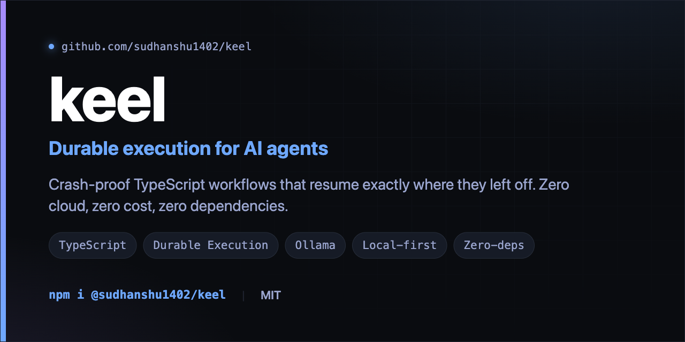
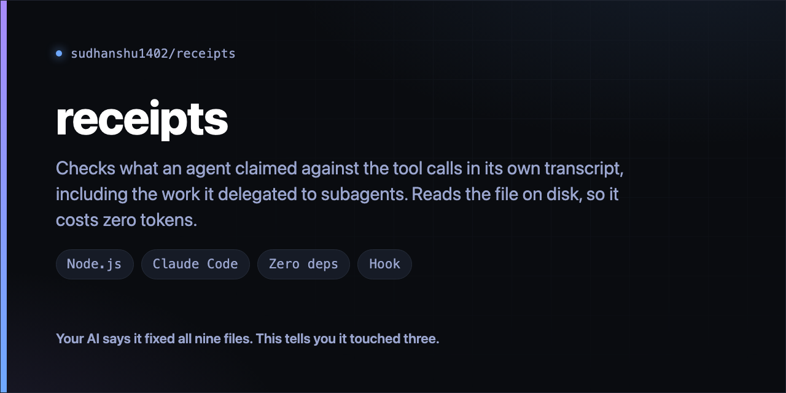
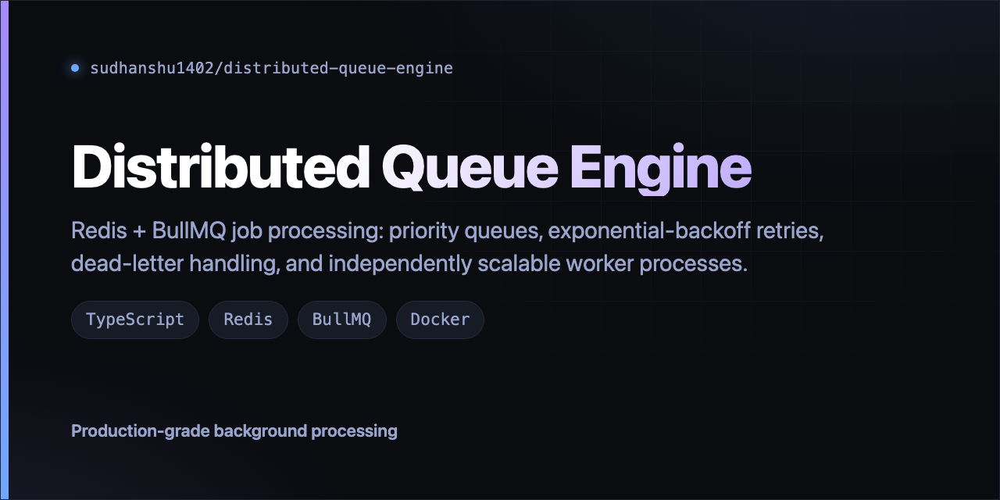
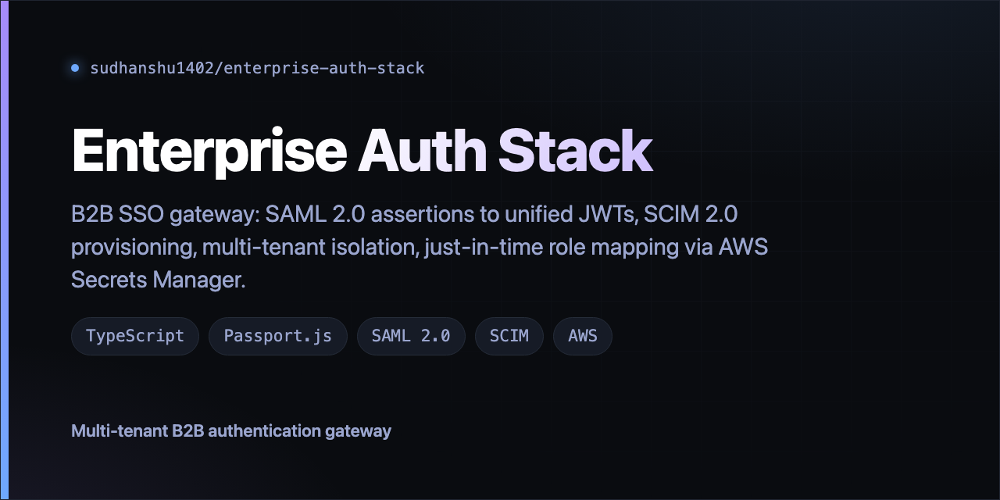
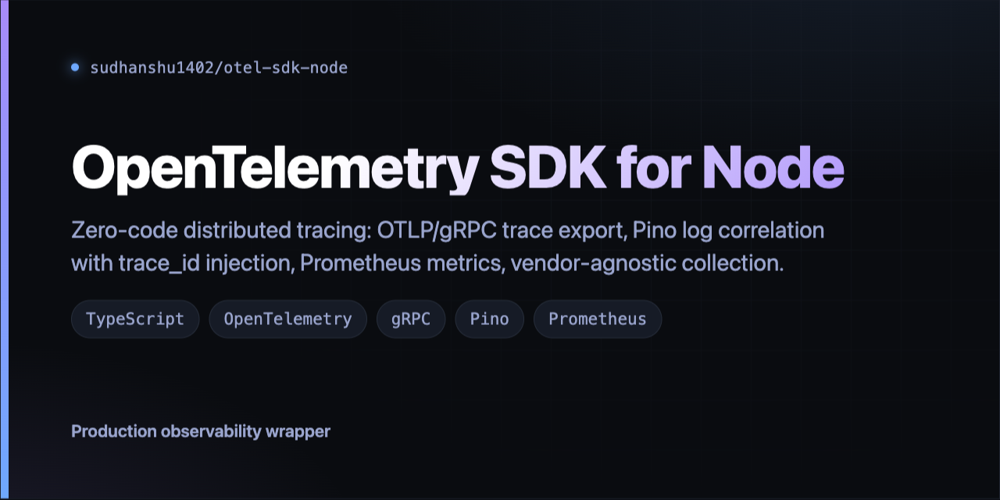
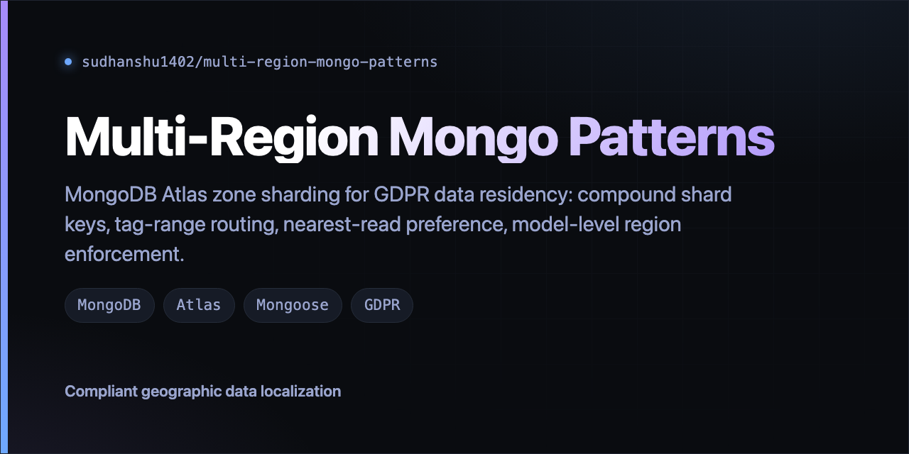
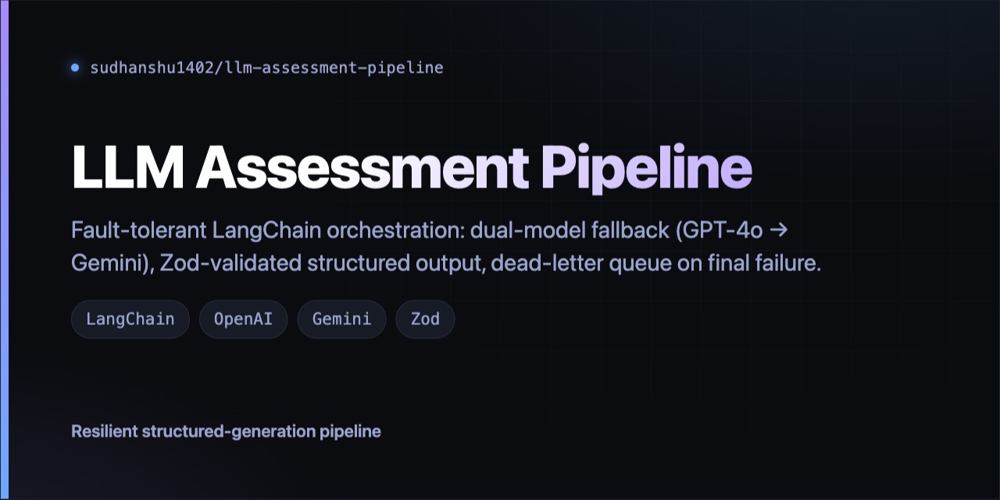
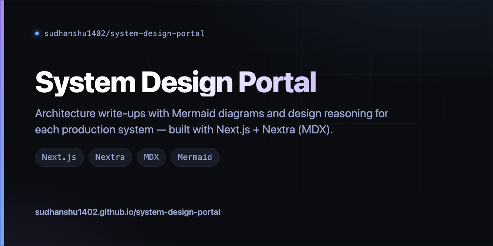
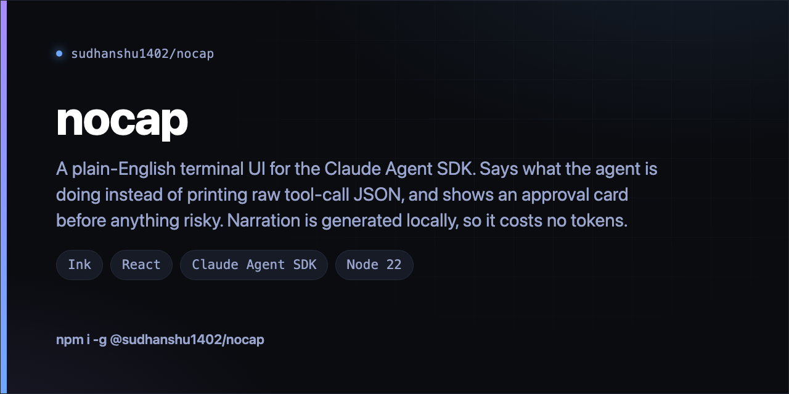

# social-share-cards

**Nine hand-built 1280x640 social preview cards for my repos, from plain HTML and CSS. No build step, no dependencies.**

GitHub shows a preview card whenever a repo link is pasted into Twitter, LinkedIn or Slack. The default is auto-generated and looks the same for everyone. These replace it. Every image below is the real export, produced by `scripts/export-cards.py` from the HTML in `templates/`.

| | | |
|---|---|---|
|  |  |  |
|  |  |  |
|  |  |  |
|  | | |

## Files

| File | Renders |
|---|---|
| `templates/social-cards.html` | Eight cards on one page: profile plus one per project repo |
| `templates/keel-card.html` | Standalone card for `keel`, bigger title treatment |
| `exports/*.png` | The exported images above |
| `scripts/export-cards.py` | Renders any card to `exports/` in headless Chrome |
| `scripts/check-cards.py` | Checks every export is 1280x640 and matches a declared card |

## Exporting

```bash
python3 scripts/export-cards.py                  # every card
python3 scripts/export-cards.py otel-sdk-node    # one, by exported filename
```

It pulls each card out of the template, renders it alone in headless Chrome at 1280x640, and writes `exports/<name>.png`. Nothing needed beyond Chrome at the standard macOS path. New headless does not always exit after the screenshot, so the script waits for the PNG to stop growing and then ends the process itself.

By hand, if you would rather: open the HTML, DevTools, Elements, select the `.card` element, kebab menu, "Capture node screenshot".

Then upload at repo Settings, Social preview, Edit. Stale exports are the failure mode: the text lives in HTML, the uploaded image does not, so re-export and re-upload after editing a card.

## Checking

```bash
python3 scripts/check-cards.py
# checked 10 exports against 10 declared cards, 0 failed
```

Every PNG must be exactly 1280x640, and the filenames the `.cap` lines declare must be the same set as the files in `exports/`. GitHub wants 2:1 and crops anything else, so an off-aspect export loses content. `.github/workflows/cards.yml` runs this on push and pull request. It cannot tell whether an image's text matches its template; that part is on you.

## Editing

Inline HTML and CSS throughout. Edit the `<h1>`, `.desc`, `.chips` and `.foot` blocks. New card: copy a `.card` block and change the text. Colours are CSS variables at the top of each file, so retheming is one edit.

## Scope

A small personal utility, not a library. No generator, no CLI, no template engine. For ten cards, hand-editing HTML beats building a pipeline. If the repo count grows a lot, data-driven generation starts making sense.

## License

MIT
